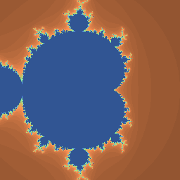
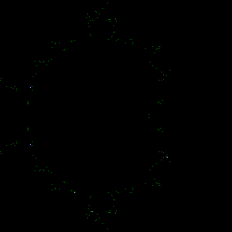

# ImageApprovals

**Warning:** the project is in early stages of development as should be considered to be a proof of concept.

## Contents:

1. [Introduction](#Introduction)

2. [The Challenge](#The-Challenge)

3. [Setup](docs/setup.md)

## Introduction

`ImageApprovals` extends [ApprovalTests.cpp] with the ability to verify correctness of graphical output, such as 3D renders or user interfaces.

To quote [ApprovalTests.cpp]'s documentation:

> Approval Tests simplify the verification of outputs. They do this by writing the outputs to a file, which once saved, becomes your spec.
> 
> You still supply the inputs, but Approval Tests gives you powerful ways of viewing complex outputs, meaning you can move on to the next feature or next test more quickly.

Out of the box, [ApprovalTests.cpp] supports only verification of text outputs. This library extends it by adding support for 2D images (with either integer or floating-point values).

## The Challenge

[ApprovalTests.cpp] works by comparing output generated by code under test with previously approved reference. Approval tests pass when generated output exactly matches the reference and fail otherwise.

This approach cannot be applied to computer-generated images directly. Typically, it is impossible to guarantee perfect repeatability of a rendering algorithm. Two runs of the same algorithm with the same inputs could produce different outputs, depending on hardware, software, compiler, etc.

The following images demonstrate this problem.

| GPU #1 (Intel)                        | GPU #2 (nVidia)                       | Difference                                           |
| ------------------------------------- | ------------------------------------- | ---------------------------------------------------- |
|   |  |  |

Images above where generated by the same implementation of Mandelbrot set visualization in OpenGL ([source](https://github.com/p-podsiadly/ImageApprovalsDemos/tree/master/gl_demo)), run with the same inputs, but on two different GPUs. While these images are indistinguishable for a human, it turns out that a small number of pixels in both images have slightly different values.

The image the right shows differences between pixel values, with significantly increased contrast (in reality, differences between pixel values are below 2/255 per channel).

Such differences can have a variety of causes (e. g. different order of evaluation in floating-point arithmetic or hardware differences) and, in practice, cannot be avoided.

[ApprovalTests.cpp]: https://github.com/approvals/ApprovalTests.cpp
